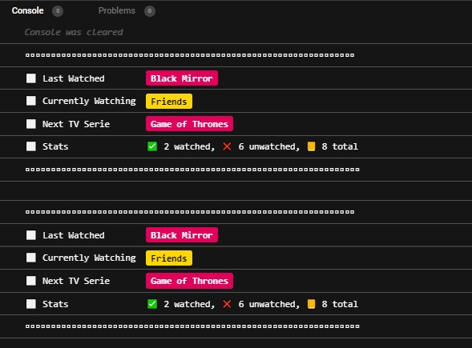
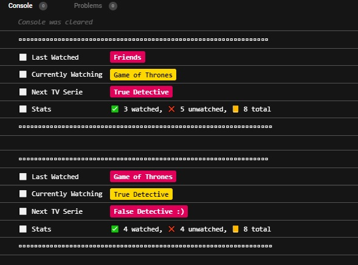

# TV Series Tracker

Bu repo [Patika](https://www.patika.dev) , AloTech FullStack Bootcamp NodeJs Eğitiminde Verilen 4. Hafta ödevidir.

Proje ödevi:

```sh
https://codesandbox.io/s/magical-silence-vsob4?file=/src/index.js:1784-2411
```

Projenin canlı örneği:

```sh
https://codesandbox.io/s/wispy-star-4vogx?file=/src/index.js
```

## Konsol Çıktısı:
#### After Add Called


#### After Finish Series


#### Test Passed


## Tech

- [Node.Js](https://nodejs.org/en/)